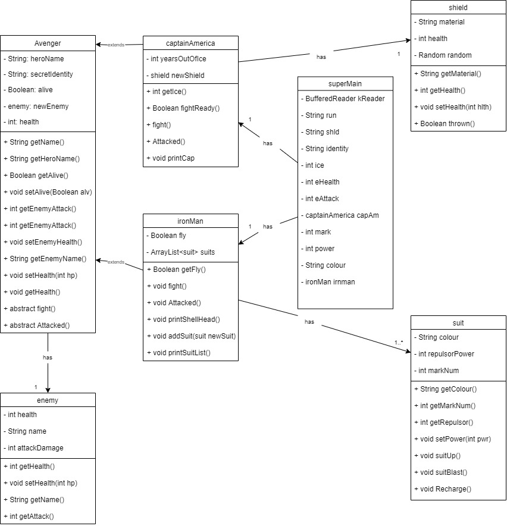

# ICS4U OOP Assignment

[*see instructions for details*](Instructions.md)

## Summary
My system models a fight between 2 avengers and their respective "enemy" it allows the user to customize the characters and control a few of their decision within the "battle". In the main program the user picks what attributes to assign to each avenger. Captain america has a shield object while iron man has a list of suit objects that user can choose from. Each avenger also has their own enemy object in which the user can customize as well. The fight simulation makes use of the different methods within the classes.

